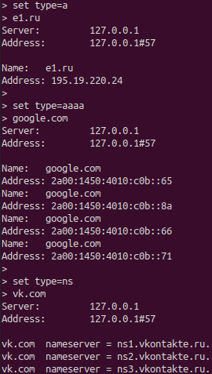

# DNS server
Simple DNS server.
Connection is over `UDP` protocol, there is caching.
The server supports request and response types: `a, aaaa, ns`.

You can configure the server with `settings.json`.
There you can specify ip and port of the root dns server, ip for the server, port for the listing, size for pending datagrams, file path for caching requests and period to clear the cache. 

**_Query resolution is automatic, the final response is displayed to the client._**

### Cache description:
The cache is loaded from the specified file, cleaned according to the TTL response of the dns server. 
Each new request is written to the cache, the repeated request retrieves the response from the cache.
Also cache is cleaned while server is running, at the end of program operation backup is performed.

### Usage:

```
python3 main.py
```

###Example of work with `nslookup` client:
The server works on ip=127.0.0.1 with port=57

